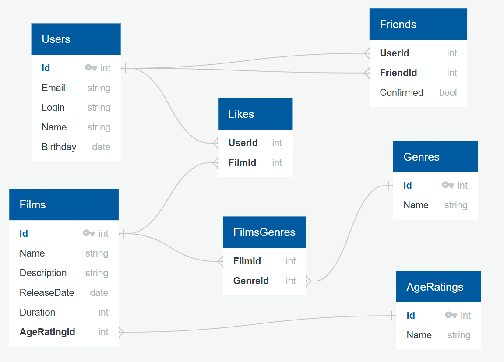

# java-filmorate

## Диаграмма базы данных _filmorate_


## Примеры запросов

### Получение 10 самых популярных фильмов
```sql
SELECT f.*
FROM films AS f
JOIN likes AS l ON f.id = l.film_id
GROUP BY f.id
ORDER BY COUNT(l.film_id) DESC
LIMIT 10;
```

### Получение друзей пользователя с _id_ = 1
```sql
SELECT u.*
FROM users AS u
JOIN friends ON u.id = friend_id
WHERE user_id = 1
```

### Получение общих друзей для пользователей с _id_ = 1 и _id_ = 2
```sql
SELECT u.*
    FROM users AS u
    JOIN friends ON u.id = friend_id
    WHERE user_id = 1
INTERSECT
SELECT u.*
    FROM users AS u
    JOIN friends ON u.id = friend_id
    WHERE user_id = 2
```

### Получение списка не одобренных запросов в друзья для пользователя с _id_ = 1
```sql
SELECT *
FROM users
WHERE id IN (
    SELECT f.user_id
    FROM friends AS f
    WHERE f.friend_id = 1 AND NOT EXISTS (
        SELECT 1
        FROM friends AS f2
        WHERE f2.user_id = 1 AND f2.friend_id = f.user_id
    )
);