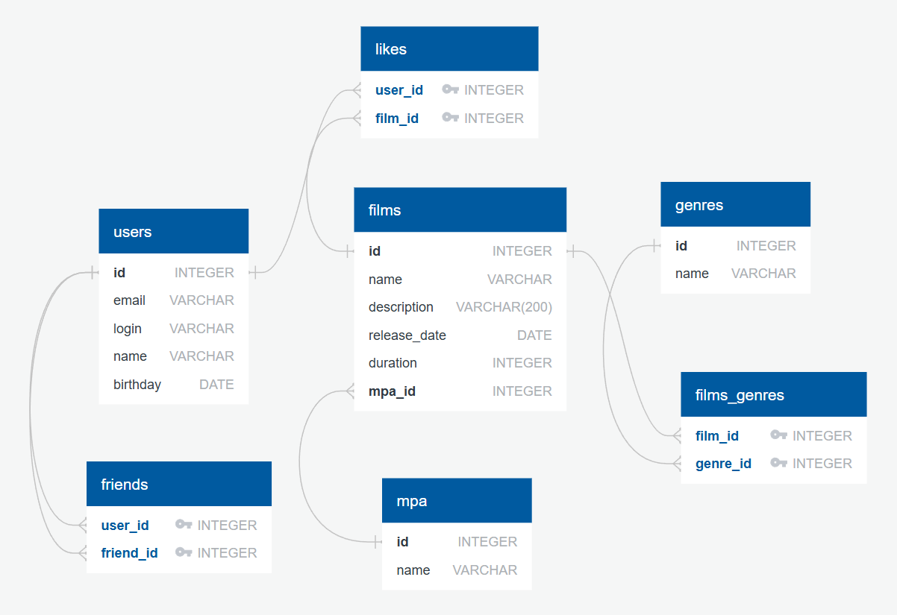

# java-filmorate

## Диаграмма базы данных _filmorate_


## Примеры запросов

### Получение 10 самых популярных фильмов
```sql
SELECT f.*
FROM films AS f
JOIN likes AS l ON f.id = l.film_id
GROUP BY f.id
ORDER BY COUNT(l.film_id) DESC
LIMIT 10;
```

### Получение друзей пользователя с _id_ = 1
```sql
SELECT u.*
FROM users AS u
JOIN friends ON u.id = friend_id
WHERE user_id = 1
```

### Получение общих друзей для пользователей с _id_ = 1 и _id_ = 2
```sql
SELECT u.*
    FROM users AS u
    JOIN friends ON u.id = friend_id
    WHERE user_id = 1
INTERSECT
SELECT u.*
    FROM users AS u
    JOIN friends ON u.id = friend_id
    WHERE user_id = 2
```

### Получение списка не одобренных запросов в друзья для пользователя с _id_ = 1
```sql
SELECT *
FROM users
WHERE id IN (
    SELECT f.user_id
    FROM friends AS f
    WHERE f.friend_id = 1 AND NOT EXISTS (
        SELECT 1
        FROM friends AS f2
        WHERE f2.user_id = 1 AND f2.friend_id = f.user_id
    )
);
```

### Получение событий пользователя
```sql
SELECT *
FROM events
WHERE user_id = 1
ORDER BY timestamp ASC, event_id ASC;
```

## Реализованные фичи

### Лента событий
В приложении добавлена таблица `events` и реализован механизм ленты событий.  
Теперь все ключевые действия пользователей фиксируются и доступны через API:

- добавление и удаление лайков к фильмам;
- добавление и удаление друзей;
- операции с отзывами (если включены).

Каждое событие содержит:
- `eventId` — идентификатор события,
- `timestamp` — время события (мс с эпохи),
- `userId` — пользователь, инициировавший событие,
- `eventType` — тип события (`LIKE`, `FRIEND`, `REVIEW`),
- `operation` — операция (`ADD`, `REMOVE`, `UPDATE`),
- `entityId` — идентификатор сущности (фильм, друг, отзыв).

#### Пример запроса
```
GET /users/{id}/feed
```

#### Пример ответа
```json
[
  {
    "eventId": 1,
    "timestamp": 1713456789012,
    "userId": 5,
    "eventType": "LIKE",
    "operation": "ADD",
    "entityId": 10
  },
  {
    "eventId": 2,
    "timestamp": 1713456789055,
    "userId": 5,
    "eventType": "FRIEND",
    "operation": "REMOVE",
    "entityId": 3
  }
]
```

### Удаление фильмов и пользователей
Добавлены новые эндпоинты:

- `DELETE /films/{filmId}` — удаление фильма по идентификатору.
- `DELETE /users/{userId}` — удаление пользователя по идентификатору.

Удаление сопровождается очисткой связанных данных и записью события в ленту.